+++
title = "Git-#1: Installation"
date = "2024-10-11T09:08:37Z"
author = "imortio"
authorTwitter = "" #do not include @
slug = "1-git-installation"
cover = "cover.png"
tags = ["tutorial", "instal", "git", "versioncontrolsystem"]
keywords = ["Git", "Git setup", "Git for beginners", "Installing Git", "Software development tools"]
description = "Install Git on your system with this guide, covering Windows, macOS, and Linux. This step-by-step walkthrough ensures a smooth setup for anyone ready to start using Git for version control."
summary = "This guide walks you through installing Git on Windows, macOS, and Linux. It provides clear steps to ensure a smooth setup, making it accessible for newcomers. Start using Git for version control and streamline your software development process."
series = "Git Fundamentals"
weight = 2
featured = false #default false
showFullContent = false #defaut false
readingTime = true #default true
hideComments = true #default true
+++

Hello everyone, we're back with me again. Last time we learned a little bit about what Git is, I'm sure you're all already understands it, what it does and why is it important, so in this article we'll continue our topic to:

# Git-#1: Installing Git

To get started with Git, first install it on your machine. This method will differ depending on the operating system you're using, but don't worry, I've got you covered whether you're using Linux, macOS, or, *cough* Windows.

## 1. Installing Git on Linux

If you’re a Linux user, installing Git is quite straightforward. You can use your package manager to install it. The commands below will get Git installed depending on your distribution:
+ on Debian/Ubuntu based systems:
  ```bash
  sudo apt update
  sudo apt install git
  ```

 If you receive any prompts indicating that additional packages or dependencies are required for the installation, just enter Y or Yes, it will automatically install all packages that essentially needed by the main package that you're installing, so it may run smoothly without you have to setting up manually so much, this also apply for any others linux distros.

+ on Fedora based systems:
  ```bash
  sudo dnf install git
  ```

+ on Arch based systems:
  ```bash
  sudo pacman -S git
  ```

and so on, because linux have about hundred of distros which come from certain linux distribution like Ubuntu, Fedora, Arch and others so you can use your own so you can use your own package manager based on the distribution you’re running. Whether it's apt on Ubuntu, dnf on Fedora, or pacman on Arch, the steps are pretty similar across the board. Just replace the command with the appropriate package manager for your system. If you're not sure which package manager your distribution uses, a quick web search will point you in the right direction, i cant write all the possible package managers because it will be too long for this article.

And if you’re one of the *real power* users, like Gentoo enthusiasts, you’re already compiling it from source anyway. No need for instructions here—you know what you’re doing.

after the installation complete you can run this command to see what version of git youre installing

```bash
git --version
```
if it show the version numbers like this then you all set:
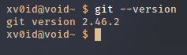


## 2. Installing Git on macOS

macOS users have a few ways to install Git, but the easiest method is through Homebrew, the package manager for macOS:
 
 1.First, install Homebrew if you haven't already by running:
 ```bash
 /bin/bash -c "$(curl -fsSL https://raw.githubusercontent.com/Homebrew/install/HEAD/install.sh)"
 ```
   Homebrew simplifies package management on macOS, making it easy to install and update software.

 2. Once Homebrew is installed, you can install Git with:
 ```bash
 brew git install
 ```
Alternatively, Git might already be installed on your system. Run the following command to check:
```bash
git --version
```
If Git is installed, it will show the version number. If not, it will prompt you to install the Xcode Command Line Tools, which includes Git.

> Sorry i cant provide the image of result from installing git on macOS since im not yet using macOS system, will update the image soon after i got a device with macOS

## 3. Installing Git on Windows

Git is available for Windows systems, and while it may not be as seamless as on other platforms, it certainly gets the job done. It's awkward, but hey, it can be done. Here's the step-by-step guide to drag yourself through it:

### 1. Download Git for Windows

1. Head to [gitforwindows.org](https://gitforwindows.org) and click the **Download** button.
   - The site will automatically detect your system and download the correct installer.

2. If the automatic download fails, you'll be redirected to GitHub. Scroll down to the **Assets** section. Select either:
   - **Git-2.47.0-32-bit.exe** (for 32-bit Windows)
   - **Git-2.47.0-64-bit.exe** (for 64-bit Windows)
   
   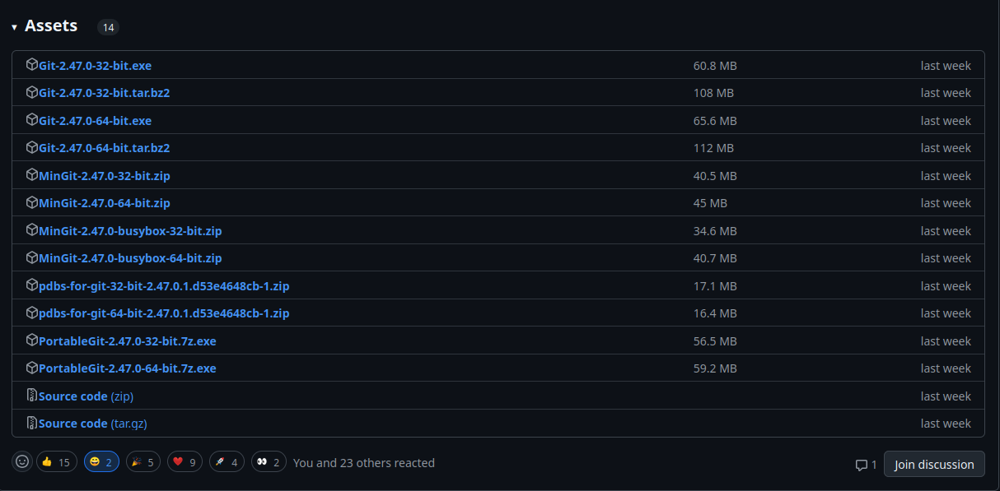

### 2. Run the Installer

1. After the download, double-click the installer (`.exe` file). You’ll see a greeting screen. Just click **Next** like a good Windows user.
   
   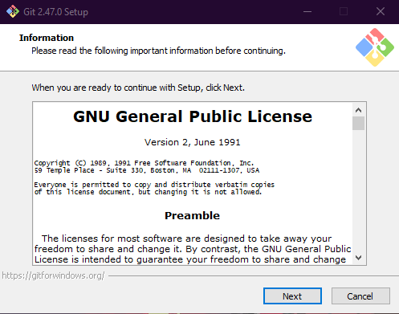

### 3. Choose Installation Path

1. The installer will ask where to install Git. The default path is fine, but if you feel adventurous, go ahead and change it. Otherwise, just click **Next**.

   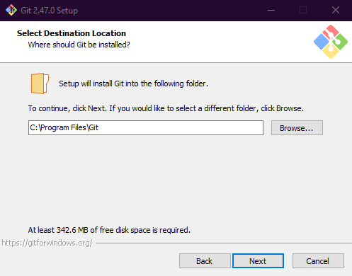

### 4. Select Components

1. You’ll now see a bunch of checkboxes with options for additional components. The defaults are fine—no need to mess around unless you know what you’re doing. Click **Next**.

   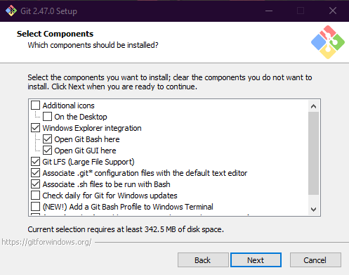

### 5. Start Menu Folder

1. This screen asks where Git should create shortcuts in the Start Menu. Just leave it as is, because, let’s be real, does anyone actually use the Start Menu anymore? Click **Next**.

   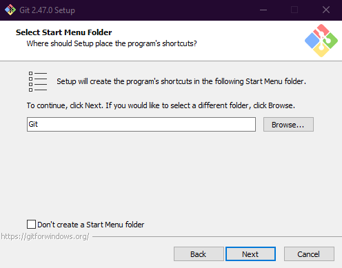

### 6. Choose Your Text Editor

1. Git will now ask which text editor you’d like to use by default. You can pick whatever you prefer. If you're undecided:
   - **VS Code** is a solid choice for beginners.
   - **Atom**, **Sublime Text**, or **Notepad++** also work if you're into simplicity.

   Pick your editor and click **Next**.

   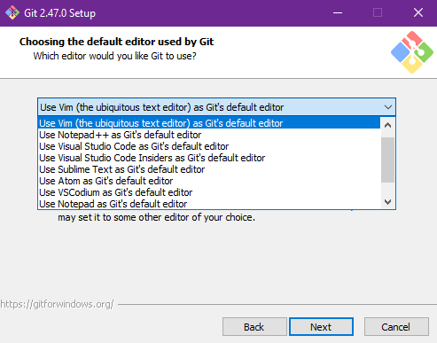

### 7. Adjust Initial Branch Name

1. The installer will prompt you to set the default branch name for new repositories. By default, it’s **master**, but the world’s moving to **main** for inclusivity. Select **Override the default and set 'main'**. Click **Next**.

   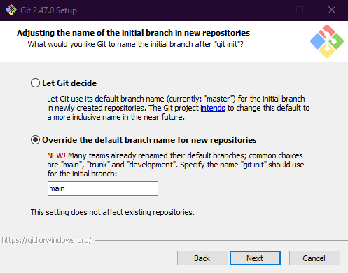

### 8. Choose Path Environment

1. Now, you’ll see options for Git’s PATH environment. Just select **Git from the command line and also from 3rd-party software** (unless you have a specific reason not to). Click **Next**.

   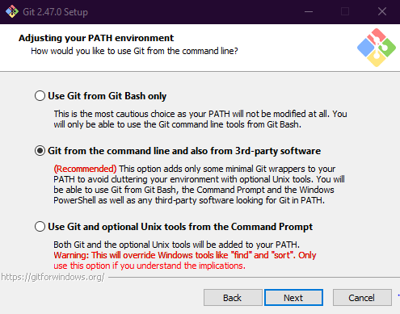

### 9. Choose SSH Executable

1. You’ll be asked which SSH executable to use. Leave it on the default, **Use bundled OpenSSH**, unless you have a custom SSH setup. Click **Next**.

   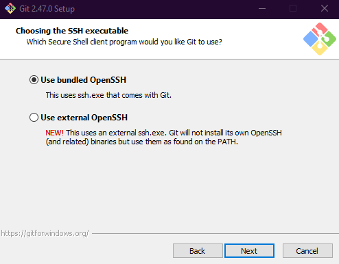

### 10. Select HTTPS Backend

1. Git will now ask which backend to use for HTTPS. Stick with **Use the OpenSSL library** for maximum compatibility and security. Click **Next**.

   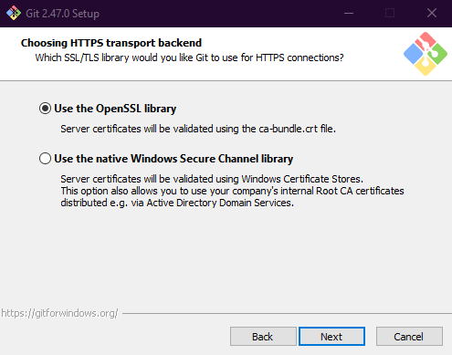

### 11. Configure Line Endings

1. This screen is about how Git handles line endings between Windows (`CRLF`) and Unix-based systems (`LF`). Keep the default **Checkout Windows-style, commit Unix-style line endings**. Click **Next**.

   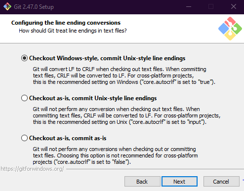

### 12. Choose Terminal Emulator

1. Git offers two options for terminal emulators: **MinTTY** or the **Windows default console**. Select **Windows default console** to avoid confusion (Windows users have it rough enough). Click **Next**.

   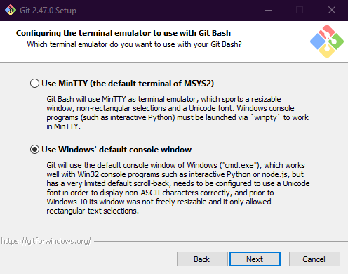

### 13. Default `git pull` Behavior

1. Decide how Git should handle `git pull`. Leave it on the default: **Default (fast-forward or merge)**. Click **Next**.

   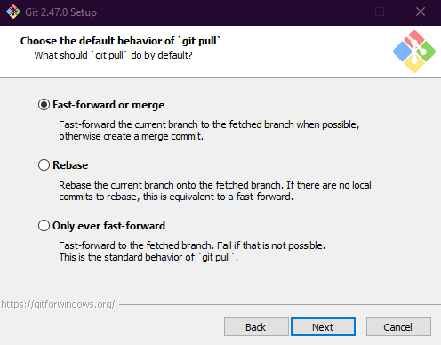

### 14. Git Credential Manager

1. You’ll be prompted to choose how Git should manage credentials. Stick with **Git Credential Manager** (recommended). Click **Next**.

   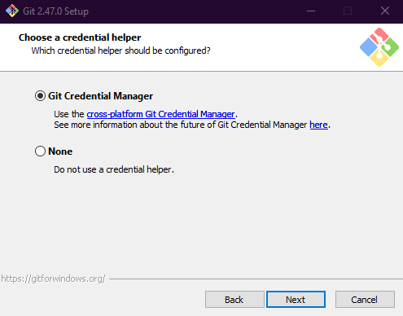

### 15. Configure Extra Options

1. Here, you'll see some optional settings like enabling experimental features. Skip these unless you’re feeling adventurous. Click **Next**.

   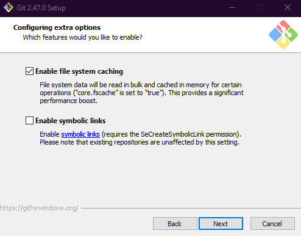

### 16. Install Git

1. Finally, click **Install** to start the process. A progress bar will appear as Git gets installed on your system.
   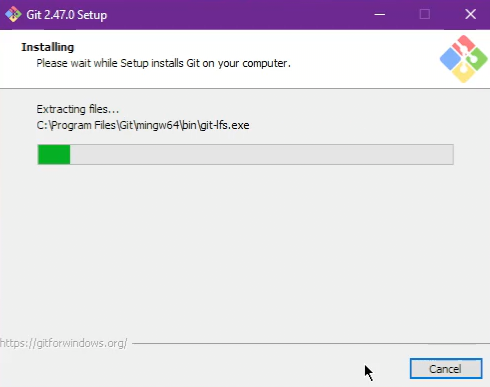

2. Once the installation completes, you’ll be asked whether you want to launch **Git Bash** and view release notes. Uncheck **View Release Notes** unless you want to dive into the minutiae. Click **Finish**.
   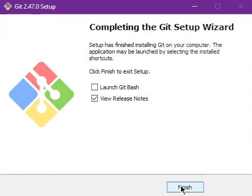

Congratulations, you've survived installing Git on Windows. Now you can finally work with Git on a system that's like the IKEA version of development environments—barely functional but somehow gets the job done.

Now let's check the version and verify that git has been successfully installed by pressing Windows key[^1] + R, and type cmd in the search bar, then click enter, write this command in cmd:

[^1]: The Windows key on the keyboard usually has the Windows logo, located at the bottom left of the keyboard between the Ctrl and Alt keys.

```bash
git --version
```
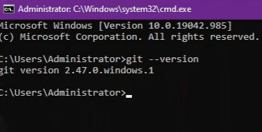

If you’re feeling masochistic, you can even use Git Bash...

---

## Configuring Git

Now that you've successfully installed Git (and survived Windows' mediocre interface), it’s time to configure it. This will let Git know who you are and how to handle certain behaviors when you start working with repositories.

### 1. Set Your Username and Email

Git tracks changes by associating them with a name and email. So, you’ll need to let Git know who you are. Open cmd and run these commands:

```bash
git config --global user.name "Your Username"
git config --global user.email "your.email@example.com"
```

Replace `"Your Username"` and `"your.email@example.com"` with your actual details, if possible and you have Github account, be sure to make the username and email be the same as in your Github, unless you want your commits to look like they were made by a bot. This is importantly useful when you went to collaborate with others or simply when doing `git push` to your Github remote repositories ( we will cover about this later ).

### 2. Set a Default Editor

You’ll want to set a default text editor for Git to use when writing commit messages or merging changes. If you skipped this step during the installation (or just want to change it), here’s how you can set it up in Git:

```bash
git config --global core.editor "nano"
```

Replace `"nano"` with the text editor of your choice. For instance, you can use:

- `code --wait` for Visual Studio Code, this is the best for beginners
- `subl --wait` for Sublime Text, this one is beginner friendly too and considerably more lighter, but provide less features than Visual Studio Code
- `notepad++` if you're stuck in 2007 and still using Notepad++, or when you want more simpler option

### 3. Enable Colored Output (So You Don’t Go Blind)

Git's output can be overwhelming, especially if you’re working in a terminal where everything is the same shade of "bleh". To make things easier on your eyes, enable colored output:

```bash
git config --global color.ui true
```

Now, instead of a wall of text, you’ll get colorful syntax highlighting to differentiate between added, deleted, or modified lines.

### 4. Set Up Default Branch Name to `main`

Since Git now recommends using `main` instead of `master` as the default branch name, it’s a good idea to set this globally so all your future repositories start with `main` right off the bat:

```bash
git config --global init.defaultBranch main
```

This saves you from the hassle of renaming the branch every time you create a new repository.

### 5. Enable Credential Caching

If you’re tired of typing your username and password every time you push to a remote, you can enable credential caching. This will store your credentials for a while so you don't have to keep entering them:

```bash
git config --global credential.helper cache
```

By default, Git will cache your credentials for 15 minutes. You can set a longer cache timeout if you're especially lazy (or efficient, depending on your perspective):

```bash
git config --global credential.helper 'cache --timeout=3600'
```

This will keep your credentials cached for an hour.

### 6. Set Default Merge and Rebase Preferences

You can also set how Git should handle `git pull`—whether it should try to merge, rebase, or fast-forward. Most people stick with merge (because change is scary), but if you want to set a different behavior:

```bash
git config --global pull.rebase false
```

To default to rebase instead of merging:

```bash
git config --global pull.rebase true
```

If you’re not sure, stick with `merge`—it’s the least complicated option.

### 7. Check Your Settings

To see the Git configuration you've set up, run:

```bash
git config --list
```

This is the result of mine:
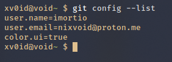

Mine is not too much because I only set the most important ones. Anyway, it will display your global configuration, including your username, email, and other settings like color preferences. If anything goes wrong, re-run the command with the correct values.

---

### Wrapping Up Configuration

By now, you should have Git fully installed and configured on your machine, whether you're on Linux, macOS, or yes, even Windows. You've also set up your username and email, which are crucial for tracking changes across your repositories. With Git up and running, you're ready to start managing your projects with powerful version control.

Next, we'll dive into creating your first repository, and then creating a new github account. Stay tuned and see you in the next topic :D

> **Note:** This article is not yet perfect, could you provide suggestions for changes or feedback so I can improve it later. Feel free to contact me anytime if you'd like here: [Email Me](mailto:nixvoid@proton.me) or [Chat Me on Whatsapp](https://wa.me/+6282284528116)
