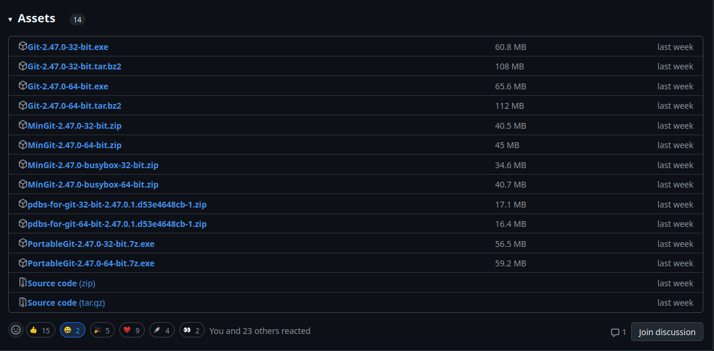
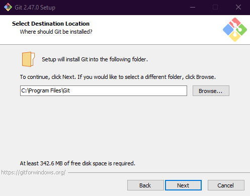
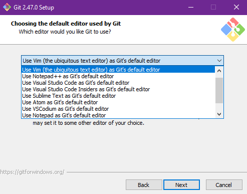
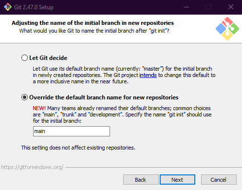
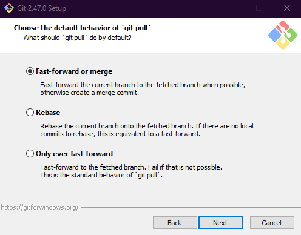
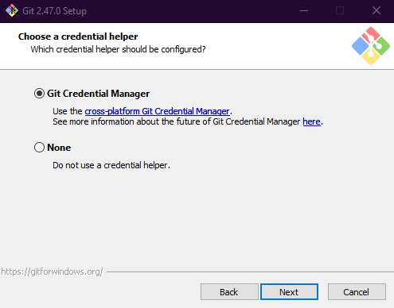

+++
title = "Git-#1: Instalasi"
date = "2024-10-11T09:08:37Z"
author = "imortio"
authorTwitter = "" #do not include @
slug = "1-pemasangan-git"
cover = "cover.png"
tags = ["tutorial", "instal", "git", "sistemversi"]
keywords = ["Git", "Mengatur Git", "Git untuk pemula", "Menginstal Git", "Alat pengembangan perangkat lunak"]
description = "Instal Git di sistem mu dengan panduan ini, mencakup Windows, macOS, dan Linux. Panduan langkah demi langkah ini memastikan pengaturan yang lancar untuk siapa saja yang siap mulai menggunakan Git untuk kontrol versi."
summary = "Panduan ini memandu kamu melalui proses instalasi Git di Windows, macOS, dan Linux. Memberikan langkah-langkah yang jelas untuk memastikan pengaturan yang lancar, sehingga mudah diakses oleh pemula. Mulailah menggunakan Git untuk kontrol versi dan permudah proses pengembangan perangkat lunak Anda."
series = "Dasar-Dasar Git"
weight = 2
featured = false #default false
showFullContent = false #default false
readingTime = true #default true
hideComments = true #default true
+++

Halo semuanya, kita kembali bersama ku lagi. Terakhir kali kita belajar sedikit tentang apa itu Git, aku yakin kalian semua sudah memahaminya, apa yang dilakukannya dan mengapa ia penting, jadi dalam artikel ini kita akan melanjutkan topik kita ke:

# Git-#1: Menginstall Git

Untuk memulai dengan Git, pertama-tama instal Git di komputer mu. Metode ini akan berbeda tergantung pada sistem operasi yang kamu gunakan, tetapi jangan khawatir, aku akan membantu mu, baik kamu menggunakan Linux, macOS, atau, *batuk* Windows.

## 1. Menginstal Git di Linux

Jika kamu adalah pengguna Linux, menginstal Git cukup mudah. Kamu bisa menggunakan manajer paket untuk menginstalnya. Perintah-perintah di bawah ini akan membuat Git terinstal, tergantung pada distribusi linux mu:
+ Pada sistem berbasis Debian/Ubuntu:
  ```bash
  sudo apt update
  sudo apt install git
  ```
 Jika kamu menerima petunjuk yang mengindikasikan bahwa paket atau dependensi tambahan diperlukan untuk instalasi, cukup masukkan Y atau Yes, maka secara otomatis akan menginstal semua paket yang pada dasarnya diperlukan oleh paket utama yang kamu instal, sehingga instalasi dapat berjalan dengan lancar tanpa kamu harus melakukan pengaturan secara manual terlalu banyak, hal ini juga berlaku untuk distro linux yang lain.

+ Pada sistem berbasis Fedora:
  ```bash
  sudo dnf install git
  ```

+ pada sistem berbasis Arch:
  ```bash
  sudo pacman -S git
  ```

dan seterusnya, karena linux memiliki sekitar ratusan distro yang berasal dari distribusi linux tertentu seperti Ubuntu, Fedora, Arch, dan lainnya sehingga Anda dapat menggunakan manajer paket mu sendiri berdasarkan distribusi yang kamu jalankan. Entah itu apt di Ubuntu, dnf di Fedora, atau pacman di Arch, langkah-langkahnya hampir sama. Ganti saja perintahnya dengan manajer paket yang sesuai untuk sistem mu. Jika kamu tidak yakin manajer paket mana yang digunakan distribusi mu, pencarian cepat di web akan membantumu akan hal itu, aku tidak dapat menulis semua manajer paket yang mungkin karena akan terlalu panjang untuk artikel ini.

Dan jika kamu adalah salah satu pengguna yang benar-benar ahli, seperti pengguna Gentoo, kamu sudah mengkompilasinya dari sumbernya. Tidak perlu instruksi di sini-kamu tahu apa yang kamu lakukan.

setelah instalasi selesai, kamu bisa menjalankan perintah ini untuk melihat versi git yang kamu instal

```bash
git --version
```
jika ada ditampilkan nomor versi seperti ini maka kamu sudah siap:


## 2. Menginstal Git di macOS

Pengguna macOS memiliki beberapa cara untuk menginstal Git, tetapi metode termudah adalah melalui Homebrew, manajer paket untuk macOS:

 1. Pertama, instal Homebrew jika kamu belum melakukannya dengan menjalankan:
 ```bash
 /bin/bash -c "$(curl -fsSL https://raw.githubusercontent.com/Homebrew/install/HEAD/install.sh)"
 ```
   Homebrew menyederhanakan manajemen paket di macOS, membuatnya mudah untuk menginstal dan memperbarui perangkat lunak.

 2. Setelah Homebrew terinstal, kamu bisa menginstal Git:
 ```bash
 brew git install
 ```
Sebagai alternatif, Git mungkin sudah terinstal pada sistem mu. Jalankan perintah berikut ini untuk memeriksanya:
```bash
git --version
```
Jika Git telah terinstal, maka akan muncul nomor versi. Jika tidak, kamu akan diminta untuk menginstal Xcode Command Line Tools, yang mencakup Git.

> Maaf aku tidak dapat memberikan gambar hasil dari menginstal git di macOS karena aku belum menggunakan sistem macOS, aku akan segera memperbarui gambarnya setelah memiliki perangkat dengan macOS

## 3. Menginstal Git di Windows

Git tersedia untuk sistem Windows, dan meskipun mungkin tidak semulus pada platform lain, tapi setidaknya Git dapat menyelesaikan pekerjaan. Memang canggung, tetapi hei, itu bisa dilakukan. Berikut ini panduan langkah demi langkah untuk membantu mu melakukannya:

### 1. Unduh Git untuk Windows

1. Pergi ke [gitforwindows.org](https://gitforwindows.org) dan klik tombol **Download**.
   - Situs ini akan secara otomatis mendeteksi sistem mu dan mengunduh penginstal yang benar.

2. Jika pengunduhan otomatis gagal, kamu akan diarahkan ke GitHub. Gulir ke bawah ke bagian **Assets**. Pilih salah satu:
   - **Git-2.47.0-32-bit.exe** (untuk Windows 32-bit)
   - **Git-2.47.0-64-bit.exe** (untuk Windows 64-bit)
   
   

### 2. Jalankan Installer

1. Setelah mengunduh, klik dua kali pada installer (file `.exe`). kamu akan melihat layar sambutan. Cukup klik **Next** seperti pengguna Windows yang baik.
   
   

### 3. Pilih Jalur Instalasi

1. Installer akan menanyakan di mana menginstal Git. Jalur default tidak masalah, tetapi jika kamu ingin eksplorasi, silakan ubah. Jika tidak, cukup klik **Next**.

   

### 4. Pilih Komponen

1. Sekarang kamu melihat banyak kotak centang dengan opsi untuk komponen tambahan. Standarnya baik-baik saja, tidak perlu diubah kecuali kamu tahu apa yang kamu lakukan. Klik **Next**.

   

### 5. Folder Start Menu

1. Bagian ini menanyakan di mana Git harus membuat pintasan di Start Menu. Biarkan saja apa adanya, karena, jujur saja, adakah orang yang benar-benar menggunakan Start Menu lagi? Klik **Next**.

   

### 6. Pilih Editor Teks Mu

1. Git sekarang akan menanyakan editor teks mana yang ingin kamu gunakan secara default. kamu dapat memilih apa pun yang Anda sukai. Jika kamu ragu-ragu:
   - **VS Code** adalah pilihan yang tepat untuk pemula.
   - **Atom**, **Sublime Text**, or **Notepad++** juga bisa digunakan jika kamu menyukai kesederhanaan.

   Pilih editor mu dan klik **Next**.

   

### 7. Sesuaikan Nama Cabang Awal

1. Installer akan meminta kamu untuk mengatur nama cabang default untuk repositori baru. Secara default, nama defaultnya adalah **master**, tetapi untuk inklusivitas, kita bisa mengubahnya menjadi **main**. Pilih **Override the default** dan tetapkan **'main'**. Klik **Next**.

   

### 8. Pilih Path Environment

1. Sekarang, kamu akan melihat opsi untuk Path Environment Git. Pilih saja **Git from the command line and also from 3rd-party software** (kecuali jika kamu punya alasan khusus untuk tidak memilihnya). Klik **Next**.
   

### 9. Pilih SSH Executable

1. Kamu akan ditanya SSH Executable untuk digunakan. Biarkan pada default, **Use bundled OpenSSH**, kecuali jika kamu memiliki pengaturan SSH khusus. Klik **Next**.
   

### 10. Pilih Backend HTTPS

1. Git sekarang akan menanyakan backend mana yang akan digunakan untuk HTTPS. Pilihlah **Use the OpenSSL Library** untuk kompatibilitas dan keamanan maksimum. Klik **Next**.
   

### 11. Mengkonfigurasi Line Ending

1. Bagian ini berisi tentang bagaimana Git menangani Line Ending antara Windows (`CRLF`) dan sistem berbasis Unix (`LF`). Pertahankan default **Checkout Windows-style, commit Unix-style line endings**. Klik **Next**.

   

### 12. Pilih Terminal Emulator

1. Git menawarkan dua opsi untuk emulator terminal: **MinTTY** atau **Konsol default Windows**. Pilih **Windows' default console** untuk menghindari kebingungan (pengguna Windows sudah cukup terbiasa). Klik **Next**.

   

### 13. Perilaku `git pull` default

1. Tentukan bagaimana Git harus menangani `git pull`. Biarkan pada default: **Default (fast-forward or merge)**. Klik **Next**.

   

### 14. Pengelola Kredensial Git

1. Kamu akan diminta untuk memilih bagaimana Git mengelola kredensial. Pilihlah **Git Credential Manager** (disarankan). Klik **Next**.

   

### 15. Mengonfigurasi Opsi Tambahan

1. Di sini, kamu akan melihat beberapa pengaturan opsional, seperti mengaktifkan fitur eksperimental. Lewati saja kecuali kamu ingin sedikit eksplorasi. Klik **Next**.
   

### 16. Instal Git

1. Terakhir, klik **Install** untuk memulai proses. Bar progress akan muncul saat Git sedang diinstal di sistem mu.
   

2. Setelah instalasi selesai, kamu akan ditanya apakah kamu ingin meluncurkan **Git Bash** dan melihat catatan rilis. Hapus centang pada **View Release Note** kecuali jika kamu ingin menyelami hal-hal kecil. Klik **Finish**.
   

Selamat, kamu telah berhasil menginstal Git di Windows. Sekarang kamu akhirnya bisa bekerja dengan Git pada sistem yang seperti lingkungan development versi IKEA-hampir tidak berfungsi tetapi entah bagaimana bisa menyelesaikan pekerjaan.

Sekarang mari kita periksa versinya dan verifikasi bahwa git telah berhasil diinstal dengan menekan tombol Windows[^1] + R, dan ketik cmd pada bar pencarian, lalu klik enter, tuliskan perintah ini pada cmd:

[^1]: Tombol Windows pada keyboard biasanya memiliki logo Windows, berada pada bagian kiri bawah keyboard diantara tombol Ctrl dan Alt.

```bash
git --version
```


Jika kamu merasa masokis, kamu bahkan dapat menggunakan Git Bash...


---

## Mengkonfigurasi Git

Sekarang setelah kamu berhasil menginstal Git (dan selamat dari antarmuka Windows yang biasa-biasa saja), saatnya untuk mengonfigurasinya. Ini akan memberi tahu Git siapa kamu dan bagaimana menangani perilaku tertentu saat kamu mulai bekerja dengan repositori.

### 1. Atur Nama Pengguna dan Email Mu

Git melacak perubahan dengan mengaitkannya dengan nama dan email. Jadi, Anda harus memberi tahu Git siapa Anda. Buka cmd dan jalankan perintah-perintah ini:

```bash
git config --global user.name "Username Kamu"
git config --global user.email "email.kamu@contoh.com"
```

Ganti `“Username Kamu”` dan `“email.kamu@contoh.com”` dengan detail kamu yang sebenarnya, jika memungkinkan dan kamu memiliki akun Github, pastikan username dan email sama dengan yang ada di Github, kecuali jika kamu ingin commit mu terlihat seperti dibuat oleh bot. Hal ini sangat berguna ketika kamu berkolaborasi dengan orang lain atau ketika melakukan `git push` ke repositori jarak jauh Github mu (kita akan membahasnya nanti).

### 2. Menetapkan Editor Default

Kamu perlu mengatur editor teks default untuk digunakan Git saat menulis pesan commit atau menggabungkan perubahan. Jika kamu melewatkan langkah ini selama instalasi (atau hanya ingin mengubahnya), berikut ini adalah cara untuk mengaturnya di Git:
```bash
git config --global core.editor "nano"
```

Ganti `“nano”` dengan editor teks pilihan mu. Misalnya, kamu dapat menggunakan:

- `code --wait` untuk Visual Studio Code, ini adalah yang terbaik untuk pemula
- `subl --wait` untuk Sublime Text, yang satu ini juga ramah untuk pemula dan jauh lebih ringan, tetapi menyediakan lebih sedikit fitur daripada Visual Studio Code
- `notepad++` jika kamu terjebak di tahun 2007 dan masih menggunakan Notepad++, atau ketika kamu menginginkan opsi yang lebih sederhana

### 3. Aktifkan Output Berwarna (Agar Kamu Tidak Buta)

Output Git bisa sangat banyak, terutama jika kamu bekerja di terminal yang semuanya berwarna putih. Untuk memudahkan mata mu, aktifkan output berwarna:
```bash
git config --global color.ui true
```

Sekarang, daripada melihat dinding teks putih, kamu akan mendapatkan penyorotan sintaks yang berwarna-warni untuk membedakan antara baris yang ditambahkan, dihapus, atau dimodifikasi.

### 4. Mengatur Nama Cabang Default ke `main`

Karena Git sekarang merekomendasikan penggunaan `main` dan bukannya `master` sebagai nama cabang default, ada baiknya kamu mengaturnya secara global agar semua repositori mu di masa depan dimulai dengan `main` sejak awal:

```bash
git config --global init.defaultBranch main
```

Hal ini menghindarkan mu dari kerepotan mengganti nama cabang setiap kali kamu membuat repositori baru.

### 5. Mengaktifkan Penyimpanan Kredensial

Jika kamu lelah mengetik nama pengguna dan kata sandi setiap kali kamu melakukan remote, kamu bisa mengaktifkan penyimpanan kredensial. Ini akan menyimpan kredensial mu untuk sementara waktu sehingga kamu tidak perlu terus memasukkannya:
```bash
git config --global credential.helper cache
```

Secara default, Git akan menyimpan kredensial mu dalam cache selama 15 menit. kamu bisa mengatur batas waktu cache yang lebih lama jika kamu sangat malas (atau efisien, tergantung sudut pandang mu):
```bash
git config --global credential.helper 'cache --timeout=3600'
```

Ini akan membuat kredensial mu tersimpan dalam cache selama satu jam.

### 6. Mengatur Preferensi Merge dan Rebase Default

Kamu juga dapat mengatur bagaimana Git harus menangani `git pull` - apakah ia harus mencoba menggabungkan, merge, merebase, atau mempercepat. Kebanyakan orang tetap menggunakan penggabungan (karena perubahan itu menakutkan), tetapi jika kamu ingin mengatur perilaku yang berbeda:

```bash
git config --global pull.rebase false
```

Untuk menetapkan secara default untuk rebase alih-alih merge:

```bash
git config --global pull.rebase true
```

Jika kamu tidak yakin, tetaplah `merge`-ini adalah opsi yang paling mudah.

### 7. Periksa Pengaturan Mu

Untuk melihat konfigurasi Git yang telah kamu siapkan, jalankan:

```bash
git config --list
```

Ini adalah hasil milik ku:


Punyaku tidak terlalu banyak karena aku hanya mengatur yang paling penting saja. Bagaimanapun, ini akan menampilkan konfigurasi global mu, termasuk nama pengguna, email, dan pengaturan lain seperti preferensi warna. Jika ada yang salah, jalankan kembali perintah dengan nilai yang benar.

---

### Mengakhiri Konfigurasi

Sekarang, kamu seharusnya sudah menginstal dan mengonfigurasi Git sepenuhnya di komputer mu, baik di Linux, macOS, atau bahkan Windows. Kamu juga telah menyiapkan nama pengguna dan email mu, yang sangat penting untuk melacak perubahan di seluruh repositori mu. Dengan Git aktif dan berjalan, kamu siap untuk mulai mengelola proyek mu dengan kontrol versi yang kuat.

Selanjutnya, kita akan membahas cara membuat repositori pertama mu, dan juga membuat akun github baru. Tetap pantau dan sampai jumpa di topik berikutnya :D

> **Note:** Artikel ini belum sempurna, kalian sangat diharapkan memberikan saran untuk perubahan atau umpan balik agar saya dapat memperbaikinya nanti. Jangan ragu untuk menghubungiku kapan saja jika kalian mau, di sini: [Email](mailto:nixvoid@proton.me) atau [Chat di Whatsapp](https://wa.me/+6282284528116)
