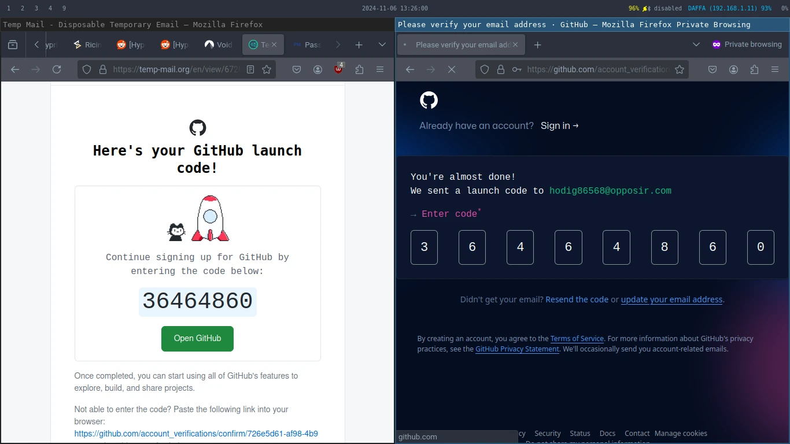
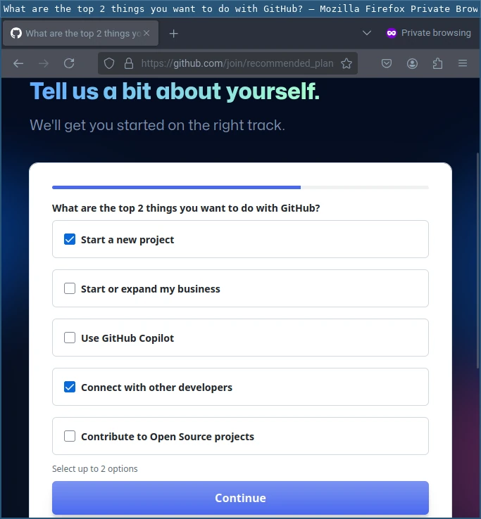
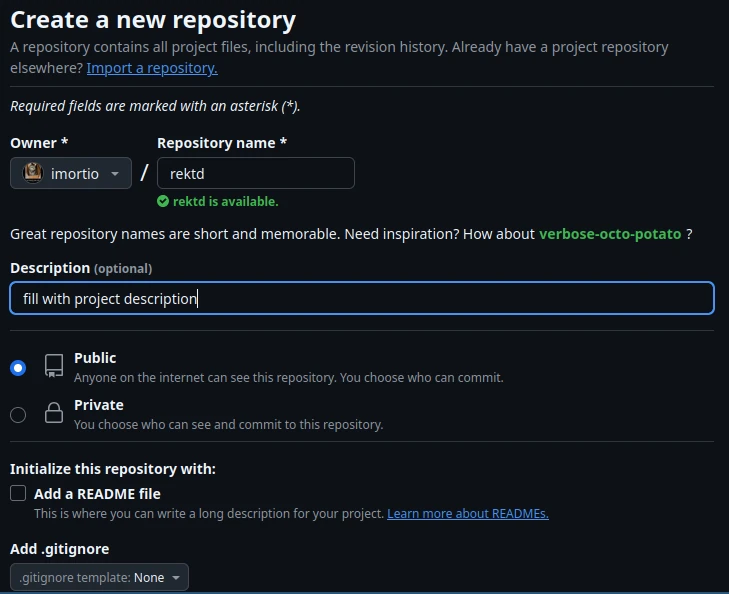

+++
title = "Git-#2: Account & Repo"
date = "2024-11-04T14:20:42Z"
author = "imortio"
authorTwitter = "" #do not include @
slug = "2-account-and-repo"
cover = "images/cover.webp"
tags = ["tutorial", "git", "init", "repo", "versioncontrolsystem"]
keywords = ["Git", "Git repo", "Git for beginners", "Initializing Git", "Software developnment tools"]
description = "Learn how to establish and setup your first Git repository, creating your new Github account, and creating a remote repo inside it. This chapter introduces Git, guiding you from setup to confidently managing code versions both locally and remotely."
summary = "In this chapter, you’ll initialize a Git repository, create a new Github account and setup it a bit. By the end, you'll be set up to handle local and remote version control effortlessly."
series = "Git Fundamental"
featured = false #default false
showFullContent = false #defaut false
readingTime = true #default true
hideComments = true #default true
+++

Hello, back with me again to continue our subject, sorry for my slow update, i was busy for a few weeks before because i attend many event both from my college and my friends, but anyway lets skip that and we move to

# Git-#2: Account & Repo

In this chapter, we’ll focus on the foundational steps of using Git effectively. We’ll cover how to:

+ Create a new Git repository: We’ll walk through the process of initializing a repository on your local machine.
+ Creating Github account: We will learn how to make a new Github account and even learn how to make a remote repositoy inside it

So then, let’s dish it out

## 1. Creating New Repository

To create your first git repository, you may follow this guide below:

 1. Open your terminal
    Launch your own terminal (or command prompt if youre using Windows)
 2. Navigate to your desired project folder
    Use `cd` command to quickly change to the folder where you want to create your repository. For an example:
    ```bash
    cd path/to/your/repo
    ```
    On Windows instead it will be using `\`, so the command would looks like this:
    ```bash
    cd path\to\your\repo
    ```

 3. Initialize the repository
    Once you have been in your desired folder, run this command to make current folder as a new Git repository:
    ```bash
    git init
    ```
    This command will sets up a new .git subdirectory inside current folder, which contain all the metadata (it works like identity in real life) for the repository.
 4. Verify the Repo
    You can confirm that the repository has been succesfully created by checking the status using:
    ```bash
    git status
    ```
    If the repo is succesfully created, you will see a message indicating that youre in default branch. Usually it will be named `master` or `main`, but since in the previous article you has been set the default branch name to `main` then it will automatically set to `main` from the default itself

Thats it, now you has been successfully create your first Git repo, now its time to add some file in it, then after that you can check again using
    ```bash
    git status
    ```
And you will see some output like this


You can set the file to `staged` by using this command:
    ```bash
    git add filename
    ```
Or if you want to set all file to `staged` you may use this instead
    ```bash
    git add .
    ```
After that run status check again and you will see some result like this:


Then to `commit` the staged files to git memory, you need to run this command:
    ```bash
    git commit -m "first commit"
    ```
The `-m` flag is used to tell git that you want to add description message to your commit, so i will be less confusing if you have many commits. You can change the "first commit" to anything you want, but in case of collaborations, you must keep it lean and clear.

---

Congrats! you have been create you first ever Git repo and even put your own first commit!.Now we can move to just a lil bit more advanced topic on

## 2. Creating Github Account

After you learn how to create you own first Git repo, you might to create one Github account so later you can save your projects on cloud. Creating a Github account is quite simple, here is few steps on how to do it:

 1. Open [github.com](https://github.com/)
    + Open your browser and type [github.com](https://github.com/) in the search bar and hit enter, you will be lead to a webpage like this:
    
 2. Click on Sign Up
    + Move you cursor to the right top of the page and click on Sign Up
 3. Fill your own Github credentials
    + After you click Sign Up, you will be taken to another page to register you as a new Github User, fill your own credentials like Username, Email, and Password. Also you might want to adjust your username and email with the one that in your local git config to avoid conflict or further confusion, which refer to [this guide](../1-installing-git/index.en.md/#configuring-git) if you have forgotten:
    
 4. Solve the captcha
    + Usually you will be given some captcha, this is for security purpose so just solve it as youre a human
    
 5. Verify your email
    + Usually, for security matter, Github will need you to confirm the email that you've been used for registering at Github, so go check your email inbox for any mail from Github, then confirm your email by clicking Verify
    
 6. Describe yourself
    + Describe what are you and what is your purpose on making your github account, like this:
    
    
    
      You may customize the selection as you wish with available options, but in most case the options that i've selected is the most common among new Github users.
 7. Choose Github plan
    Github gives you some options of plans, its like premium Github or something else similars, for advanced or big developers it could be useful but for basic usage or personal its enough just by using Free plan, after all, the free version too has been cover almost all the basic and essential function of git, you really dont need all the fancy thing in premium features if just for basic personal uses
    

Thats it, done, now you all set, but you must be want to know how to create your Github repo, so here is how you can do it:

 1. Open your Github dashboard
    + Open your Github dashboard and navigate to repository tab
    
 2. Click `Create Repository`
    + You have no repository at first, so to create one just click on `Create Repository` and you will be prompted to a form like this:
    
 3. Fill repository info
    + Now just fill the form with your desired, like the repository name, repository type (Private/Public), and License for your repository[^1]
    [^1]: Choosing a license is importantly critical for your repositories, its clarify what is your repo status and availability to public, without license they can't have right to access, copy, modify, or do anything to your repository, its crucial especialy when you deal with collaboration projects, if you confused with which license you want to use, you may use [this preference](https://choosealicense.com) of licenses to determine which one is suitable for you current project repo.
 4. Finish your repo creation
    + After you fill your repo info, then click Create, and you very own repo will be quickly created, you can find it on Repository Tab, but usually also shown on profile dashboard.

Congrats! now you has been again successfully create a new repository for your Github repo, after that you will be shown some way on how you want to connect or access you github repo from any of your devices.
    

---
## Wrapping Up

now you might want link it to your local git repo ( on you computer / device ), there is some ways on how to do it like the instructions above, its pretty clear and straightforward, but maybe some of you still didnt understand because you have no familiarity with command line yet, its okay, i will cover about how to link and connect your remote github repos to your local machine (i.e your devices), stay tuned for the next topic, and see ya :D

> **Note:** This article is not yet perfect, could you provide suggestions for changes or feedback so I can improve it later. Feel free to contact me anytime if you'd like here: [Email Me](mailto:nixvoid@proton.me) or [Chat Me on Whatsapp](https://wa.me/+6282284528116)

