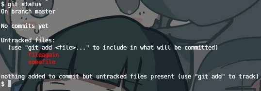
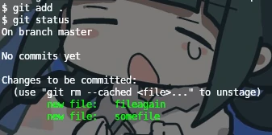
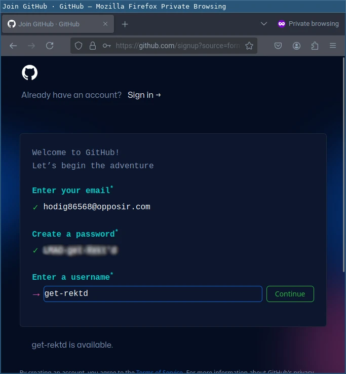
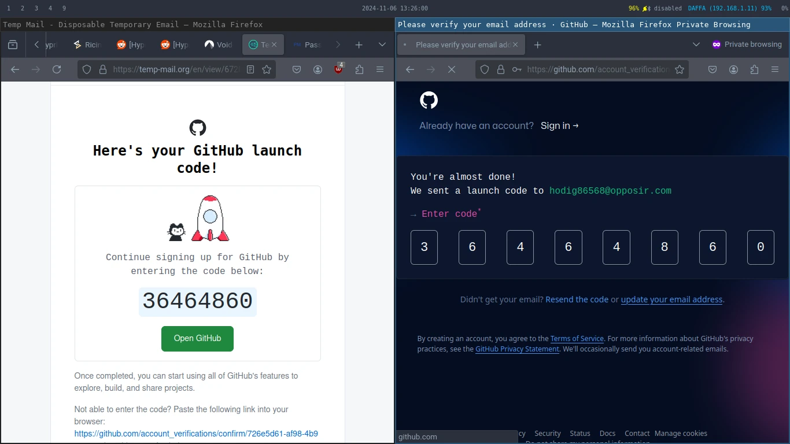
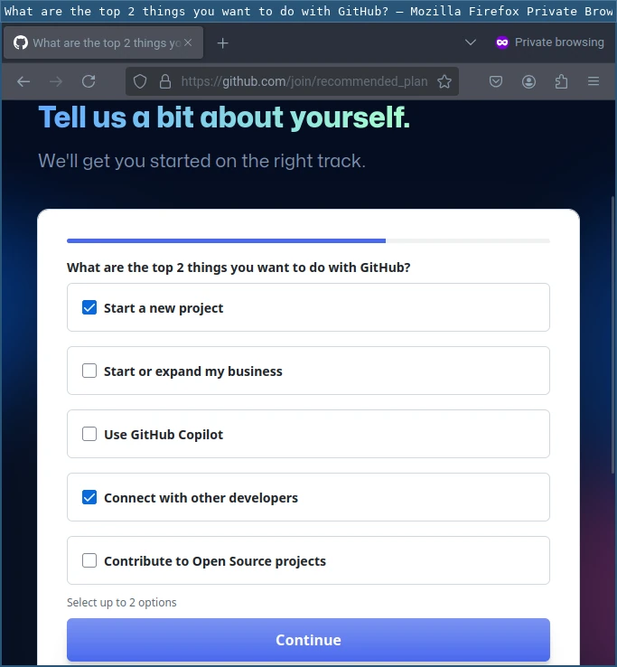
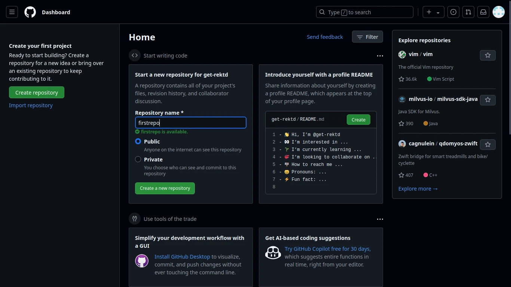
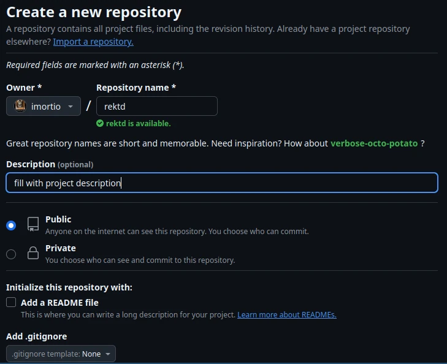
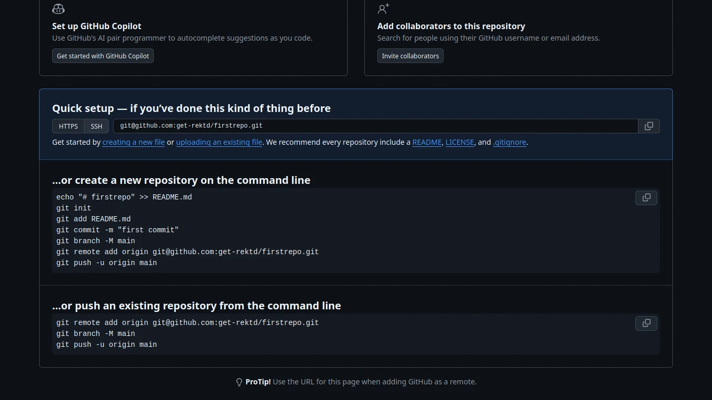

+++
title = "Git-#2: Akun & Repo"
date = "2024-11-04T14:20:47Z"
author = "imortio"
authorTwitter = "" #do not include @
slug = "2-akun-dan-repo"
cover = "images/cover.webp"
tags = ["tutorial", "git", "init", "repo", "kontrolsistemversi"]
keywords = ["Git", "Repo Git", "Git untuk pemula", "Menginstal Git", "Alat pengembangan perangkat lunak"]
description = "Pelajari bagaimana membuat dan mengatur repositori git pertamamu, membuat akun Github baru, dan membuat repositori remote didalamnya. Bab ini memperkenalkan Github, memandumu dalam mengatur sehingga nyaman dalam memanajemen kode versi baik secara lokal maupun remote."
summary = "Pada bab ini, kamu akan menginisialisasi sebuah repositori Git, membuat akun Github baru dan mengaturnya sedikit. Pada akhirnya, kamu akan dapat menghandle kontrol versi projekmu baik secara lokal maupun remote"
series = "Dasar-Dasar Git"
featured = false #default false
showFullContent = false #defaut false
readingTime = true #default true
hideComments = true #default true
+++

Halo, kembali bersamaku lagi untuk melanjutkan topik kita sebelumnya, maaf untuk update materi yang lama karena aku sedikit sibuk beberapa minggu belakangan menghadiri acara dari kampus dan juga dari temanku, tapi bagaimanapun juga, mari kita lewati bagian itu dan kita lanjut ke

# Git-#2: Akun & Repo

Pada bab ini kita akan fokus ke beberapa langkah fundamental dalam menggunakan Git secara efektif. Kita akan membahas tentang bagaimana untuk:

+ Membuat sebuah repositori Git baru: Kita akan melewati proses meninisialisasi sebuah repositori pada perangkatmu
+ Membuat akun Github: Kita akan belajar bagaimana membuat akun Github baru dan bahkan belajar bagaimana membuat sebuah remote repositori didalamnya.

Jadi, ayo kita mulai

## 1. Membuat repositori baru

Untuk membuat repositori git pertamamu, kalian bisa mengikuti panduan dibawah ini:

 1. Buka Terminal
    Jalankan terminal pilihanmu (atau command prompt jika kalian menggunakan Windows)
 2. Arahkan ke folder projek yang kalian inginkan
    Gunakan perintah `cd` untuk berganti folder secara cepat ke folder yang ingin kamu jadikan sebagai repositori, sebagai contoh:
    ```bash
    cd jalur/ke/repositori/milikmu
    ```
    Pada Windows kita menggunakan `\` daripada `/`, jadi perintahnya akan terlihat seperti ini:
    ```bash
    cd jalur\ke\repositori\milikmu
    ```
 3. Inisialisasi repositorinya
    Setelah kalian berada di folder yang kalian inginkan, jalankan perintah ini untuk membuta folder saat ini kmau berada menjadi sebuah repositori Git yang baru:
    ```bash
    git init
    ```
    Perintah ini akan membangun sebuah subdirektori baru bernama .git didalam folder yang kalian tempati sekarang, yang memuat semua metadata (ini bekerja seperti hal nya identitas pada dunia nyata) untuk repositori ini.

 4. Verifikasi repositori tersebut
    Kalian bisa mengkonfirmasi bahwa repositori tersebut sudah berhasil dibuat dengan mengecek statusnya menggunakan:
    ```bash
    git status
    ```
    Jika reponya sudah berhasil dibuat, kalian akan melihat sebuah pesan menandakan bahwa kalian berada di cabang default. Biasanya cabang ini akan bernama `master` atau `main`, tapi sejak pada artikel sebelumnya kalian sudah mengatur cabang defaultnya menjadi `main` maka secara otomatis semua cabang default kalian akan bernama `main` termasuk yang ini juga.

Begitulah caranya membuat sebuah repoitori Git, dan kalian sudah berhasil membuat satu, sekarang waktunya menambahkan berapa file kedalamnya, dan setelah itu kalian bisa cek lagi menggunakan:
```bash
git status
```
Dan kalian akan melihat beberapa output seperti ini


Kalian bisa mengatur status filenya mnejadi `staged` dengan menggunakan perintah:
```bash
git add namefile
```
Atau jika kalian ingin mengatur semua file menjadi `staged` kalian bisa menggunakan ini:
```bash
git add .
```
Setelah itu jalankan perintah untuk mengecek status lagi dan kalian akan melihat hasil seperti ini:


Kemudian untuk melakukan `commit` terhadap file yang sudah distaging ke penyimpanan git, kalian perlu menjalankan perintah ini:
```bash
git commit -m "commit pertama"
```
flag `-m` digunakan untuk memberitahu git bahwa kalian ingin menambakan pesan deskripsi ke commit yang kalian lakukan, jadi nantinya kalian tidak akan bingung jika sudah memiliki banyak commit. Kalian bisa mengganti "commit pertama" ke kalimat apapun yang kalian inginkan, tapi jika kalian berkolaborasi dengan developer lain kalian harus membuatnya tetap bersih dan jelas.

---

Selamat! kalian sudah membuat repositori Git pertama dan bahkan menambahkan commit kedalamnya!. Sekarang kita akan ke topik berikutnya yang sedikit lebih lanjut yaitu

## 2. Membuat Akun Github

Setelah kalian belajar bagaimana membuat repositori Git pertama kalinya, kalian mungkin ingin membuat sebuah akun Github agar nantinya bisa menyimpan projek kalian di penyimpanan cloud nantinya. Membuat akun Github itu cukup simpel, berikut beberapa langkah untuk membuatnya:

 1. Buka [github.com](https://github.com/)
    + Buka browser kalian dan ketikkan [github.com](https://github.com) pada bar pencarian dan tekan enter, kalian akan dibawa ke halaman web seperti ini:
    
 2. Klik pada Sign Up
    + Pindahkan kursor ke kanan atas halaman dan tekan Sign Up
 3. Isi kredensial Githubmu
    + Setelah kalian mengklik Sign Up, kalian akan dibawa ke halaman lain untuk mendaftarkan diri sebagai pengguna Github yang baru, isi kredensialmu seperti Username, Email, dan Password. Kalian juga mungkin ingin menyamakan username dan email dengan yang kalian gunakan pada pada perangkat kalian sebelumnya untuk menghindari konflik dan kebingungan nantinya, yang mengacu pada [panduan ini](../1-installing-git/index.id.md#mengkonfigurasi-git) jika sekiranya kalian sudah lupa:
   
 4. Selesaikan captcha
    + Biasanya kalian akan diberikan beberapa captcha, ini bertujuan sebagai alasan keamanan, jadi cukup selesaikan saja
    
 5. Verifikasi emailmu
    + Biasanya, untuk alasan keamanan, Github akan meminta kalian untuk mengkonfirmasi email yang kalian gunakan saat mendaftar ke Github, jadi cek inbox emailmu dan cari email yang berasal dari pihak Github, lalu konfirmasi dengan mengklik tombol Verify
    
 6. Deskripsikan dirimu
    + Deskripsikan siapa kamu dan apa tujuanmu membuat akun Github, seperti ini:
    
    

      Kalian bisa mengkostumisasi pilihannya semau kalian berdasarkan pilihan yang ada, tapi pada kebanyakan kasus, pilihan yang kupilih di atas adalah yang paling umum diantara pengguna Github yang baru.
 7. Pilih plan Github
    Github memberikan kalian beberapa pilihan plan, ini seperti Github premium atau semacamnya, untuk orang yang sudah ahli atau developer besar ini bisa jadi menguntungkan, tapi untuk penggunan dasar atau personal sudah cukup dengan menggunakan plan gratis, versi gratisnya saja sudah mencakup hampir semua fungsi dasar dan penting dari Git (Github), kalian benar benar tidak perlu semua hal mewah itu jika hanya untuk penggunan personal yang mendasar
    

Sudah, selesai, sekarang kalian sudah siap, tapi mungkin kalian ingin membuat sebuah repositori github yang baru, begini caramu melakukannya:

 1. Buka dashboard Githubmu
    + Buka dashboard Github dan arahkan ke tab repositori
    
 2. Klik `Create Repository`
    + Kalian tidak akan punya repositori pada awalnya, jadi untuk membuatnya cukup klik pada `Create Repository` dan kalian akan diberikan sebuah form seperti ini:
    
 3. Isi informasi repositori
    + Sekarang isi formnya sesuai keinginanmu, seperti nama repo, tipe repo (Privat/Publik), dan Lisensi untuk repositorimu[^1]
    [^1]: Memilih sebuah lisensi itu sangat penting untuk repositorimu, ia menjelaskan apa status dan ketersediaan dari repomu ke publik, tanpa lisensi mereka tidak punya hak untuk mengakses, menyalin, mengubah, atau melakukan apapun ke repositori milikmu, itu penting terutama ketika kalian berhadapan dengan project kolaborasi, jika kalian bingung dengan lisensi mana yang harus kalian gunakan, kalian bisa menggunakan [referensi ini](https://choosealicense.com) untuk menentukan lisensi mana yang sesuai untuk project repomu sekarang.
 4. Selesaikan pembuatan repo
 + Setelah kalian mengisi informasi repo, lalu klik pada Create, dan repo milikmu akan denga cepat dibuat, kalian bisa menemukannya di tab Repository, tapi biasanya juga ditampilkan pada dashboard profil.

Selamat! sekarang kamu sudah berhasil membuat repositori baru untuk Githubmu, setelah itu kalian akan diberikan beberapa cara untuk mengkoneksikan atau mengakses repositori github kalian dari berbagai perangkat.
    

---
## Penutup

sekarang mungkin kalian ingin menghubungkan repositori lokalmu (yang ada pada komputer/perangkatmu), disitu ada beberapa cara seperti yang ditampilkan diatas, itu cukup jelas dan lugas, tapi mungkin beberapa dari kalian ada yang belum paham karena kurang familiar dengan perintah pada terminal, tidak apa apa, di artikel selanjutnya aku akan membahas tentang cara menghubungkan repositori github dengan mesin lokalmu (contohnya komputer/laptop milikmu), tetap pantau untuk topik selanjutnya dan sampai jumpa :D

> **Note:** Artikel ini belum sempurna, kalian sangat diharapkan memberikan saran untuk perubahan atau umpan balik agar saya dapat memperbaikinya nanti. Jangan ragu untuk menghubungiku kapan saja jika kalian mau, di sini: [Email](mailto:nixvoid@proton.me) atau [Chat di Whatsapp](https://wa.me/+6282284528116)
